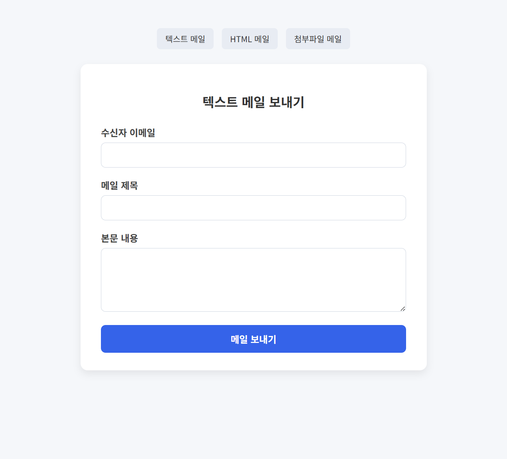
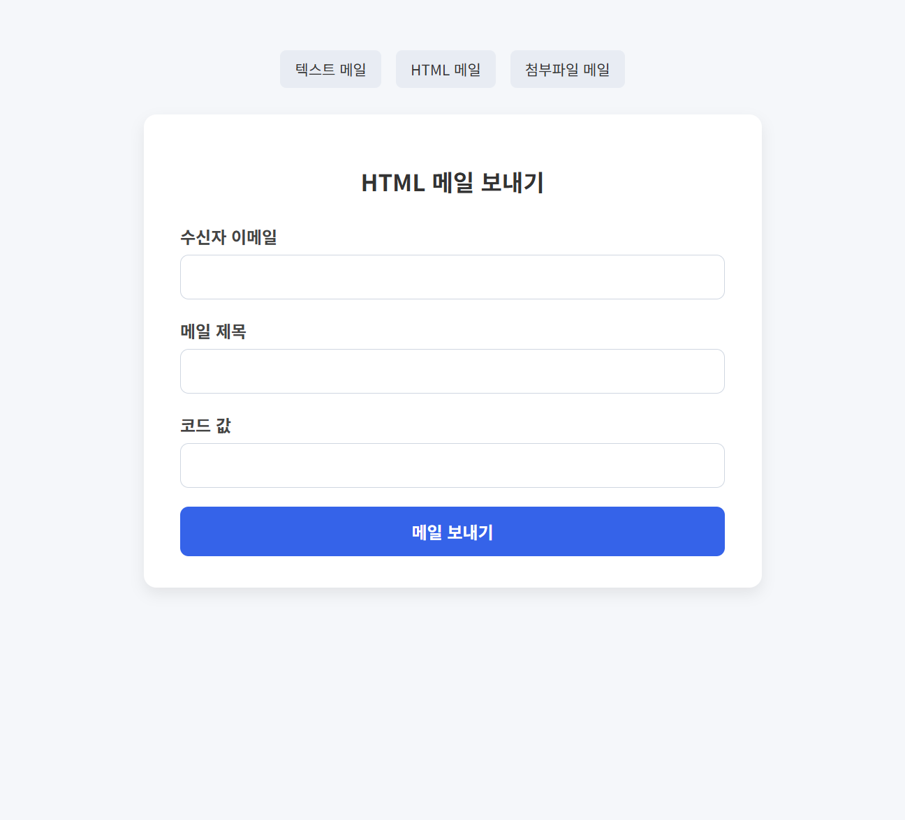
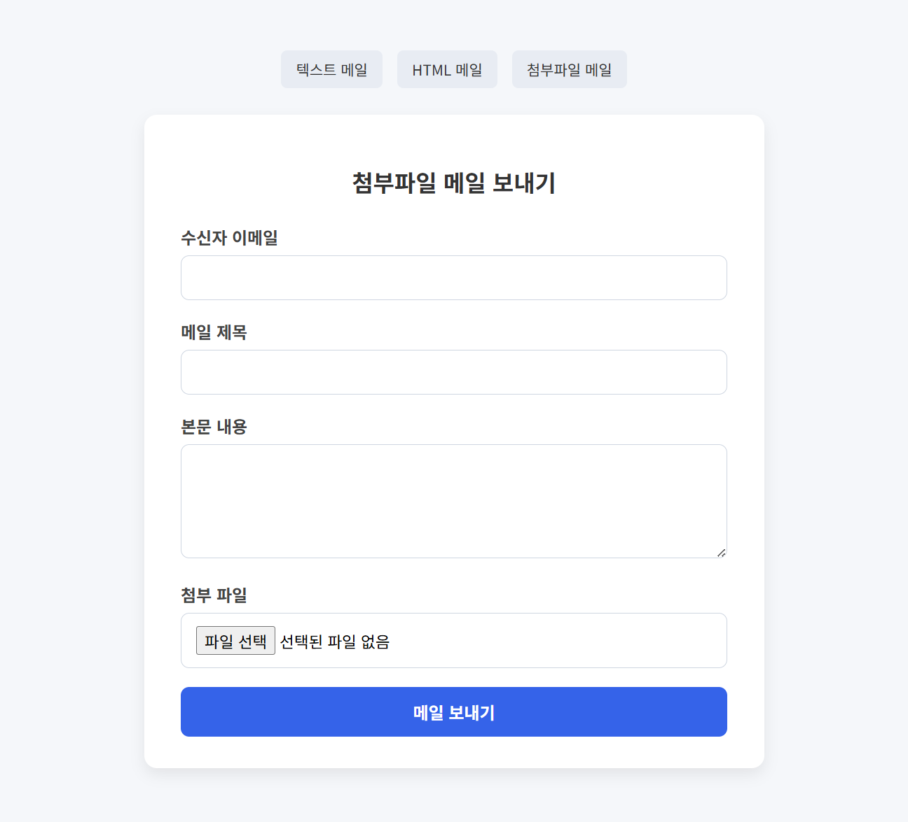
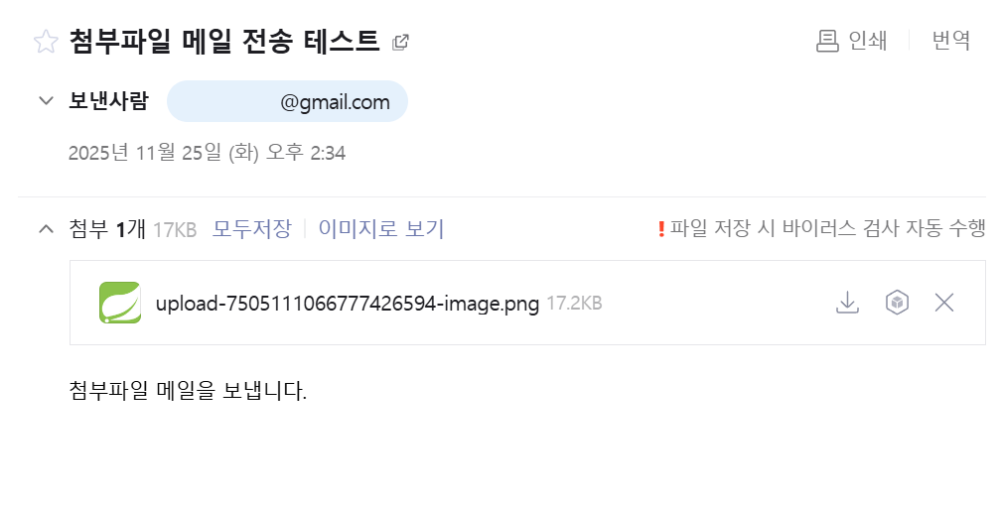

# 📧 Spring Boot Gmail SMTP Mail Demo

<br>

Gmail SMTP를 활용해 Spring Boot에서

**텍스트 메일 · HTML 템플릿 메일 · 첨부파일 메일**을 보내는 과정을 정리한 예제 프로젝트이다.

브라우저에서 바로 테스트해볼 수 있도록

Thymeleaf 기반의 **웹 UI 폼**도 함께 제공한다.

<br>

## 🚀 기능 정리

- 텍스트 메일 전송
- HTML 템플릿 메일 전송
- 첨부파일 메일 전송
- 테스트용 웹 UI 제공

<br>

## 🛠 개발 환경

- Spring Boot 3.4.12
- Java 17
- IntelliJ IDEA
- Gradle

<br>

## 📸 테스트 폼 UI

<p align="center">
  
  
  
</p>

<br>

## 📬 메일 수신 결과

<p align="center">
  
  
  
</p>

<br>

## 🔐 Gmail SMTP 설정 방법

1. Google 계정 → **보안** → 2단계 인증 활성화
2. 검색창에 **앱 비밀번호** 입력
3. 앱 비밀번호 생성 → 16자리 비밀번호 복사
4. 이 값을 `mail.password`로 사용

⚠ **주의:** Gmail 계정 비밀번호가 아니라 반드시 **앱 비밀번호**를 사용해야 한다.

<br>

## ⚙ application.yml 설정 예시

```yaml
spring:
  mail:
    host: smtp.gmail.com
    port: 587
    username: ${mail.username}
    password: ${mail.password}
    properties:
      mail:
        smtp:
          auth: true
          timeout: 5000
          starttls:
            enable: true
```

<br>

## 🌐 테스트 UI 경로

프로젝트 실행 후 아래 URL에서 테스트할 수 있다.

| 메일 타입 | URL |
| --- | --- |
| 텍스트 메일 | http://localhost:8080/mail/form/text |
| HTML 메일 | http://localhost:8080/mail/form/html |
| 첨부파일 메일 | http://localhost:8080/mail/form/attachment |

<br>

## 📘 참고

이 프로젝트는 **학습용 데모**이며,

Spring Boot에서 메일 기능을 테스트하고 이해하는 데 목적이 있다.